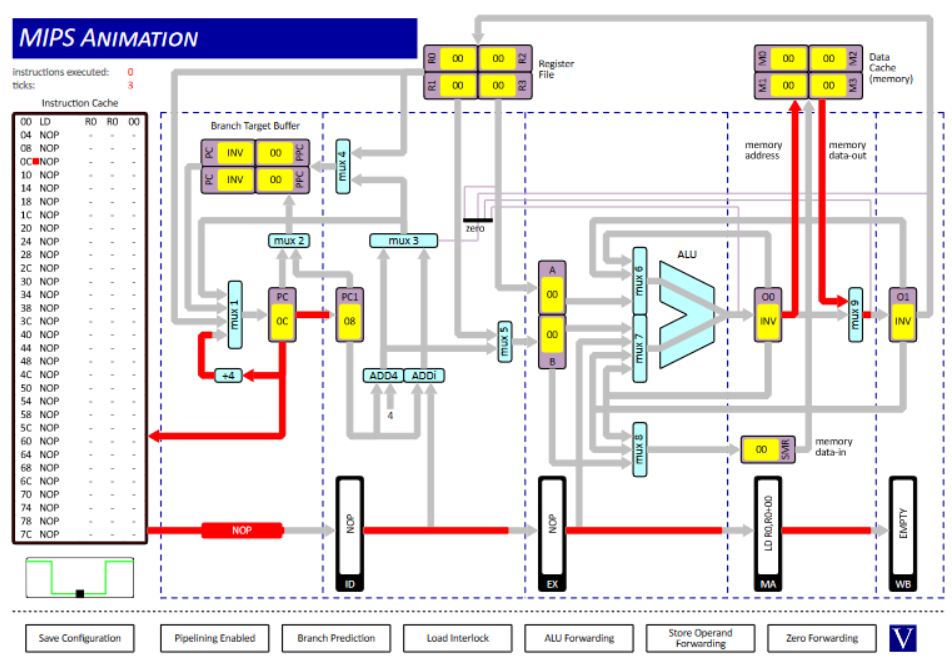
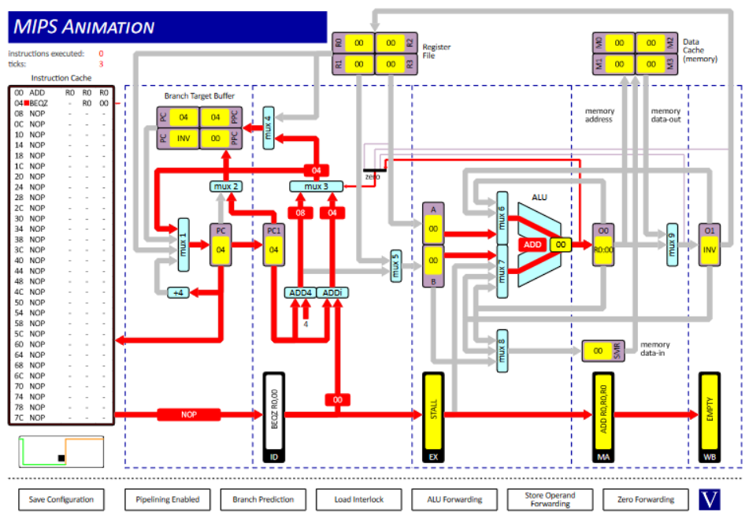
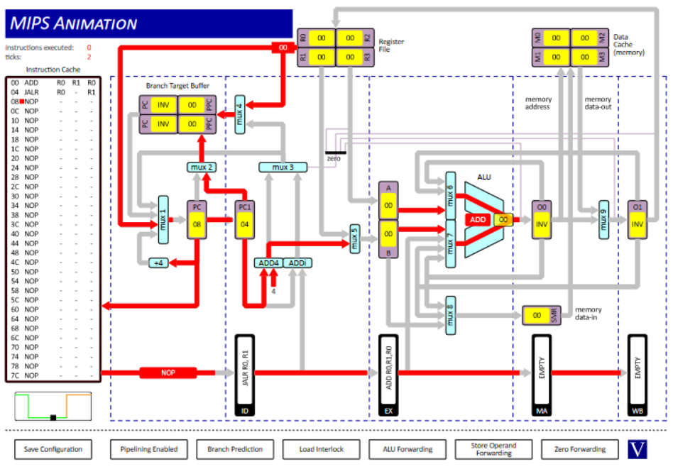
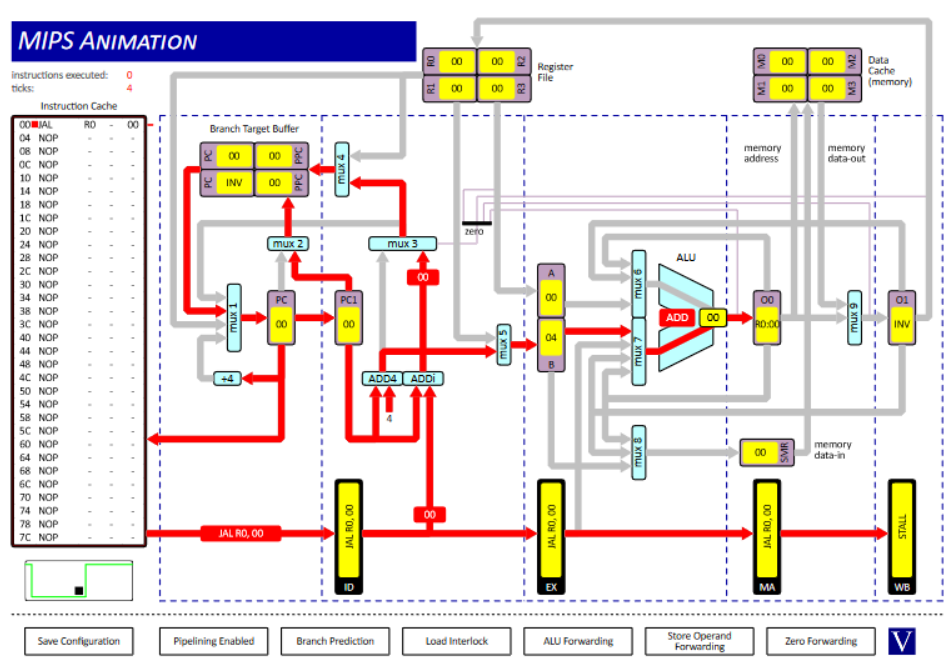

## Question 1

#### 1. O1 to MUX6

```assembly
ADD     R0, R0, R0
ADD     R1, R1, R0
ADD     R1, R0, R1
```


#### 2. O0 to MUX7 & O1 to MUX6

```assembly
ADD     R0, R0, R0
ADD     R1, R1, R0
ADD     R1, R0, R1
```


#### 3. O0 to MUX8

```assembly
ST      R0, R0, 0
```


#### 4. EX to MUX7

```assembly
ST      R0, R0, 0
```


### 5. DC to MUX9

```assembly
LD      R0, R0, 0
```



#### 6. O0 to ZD

```assembly
ADD     R0, R0, R0
BEQZ    R0, 0
```



#### 7. RF to MUX1

```assembly
ADD     R0, R1, R0
JALR    R0, R1
```



#### 8. BTB to MUX1

```assembly
JAL     R0, 0
```



## Question 2

| Question | R1 Value | Clock Cycles | Explanation
| - | - | - | - |
| (i) | `15` | `10` | Results in `O0` and `O1` can be fed back into the ALU without waiting for the values to be put in and gotten from the register file. |
| (ii) | `15` | `18` | Need to stall between instructions so that the registers can be updated as we don't store results in `O1` or `O0`. |
| (iii) | `6` | `10` | No stalls are used so values are accessed before the correct data has been put into the register file leading to the incorrect result.  |

## Question 3

#### (i)

| Instructions | Clock Cycles |
| - | - |
| `38` | `50` |

The difference is due to stall cycles.

| Number of Cycles | Explanation |
| - | - |
| `4` | Due to the filling up of the pipeline at the start of the program. |
| `4` | Due to `LD` and `SRLi` both depending on R2 (see *(iii)*) - occurs 4 times. |
| `2` | Due to `J` as the processor needs to fetch the next instruction (`BEQZ` instead of `ST`) - occurs twice. |
| `2` | Due to branch prediction incorrectly loading the instruction following `BEQZ` - occurs twice. |


#### (ii)

| Instructions | Clock Cycles |
| - | - |
| `38` | `53` |

There are 3 more stall cycles than in *(i)*. These are due to there being no branch prediction for the unconditional jump instruction. The unconditional jump occurs 4 times but seeing as branch prediction makes a mistake at cycle `43` for the `BEQZ` instruction there is only an increase in `4 - 1 = 3` stall cycles.

#### (iii)

| Instructions | Clock Cycles |
| - | - |
| `38` | `46` |

Both `LD` and `SRLi` accessed `R2` which meant that the processor needed to stall once after `LD` so that the register could be updated before it was accessed by `SRLi`. If we swap the two instructions we no longer access `R2` twice in a row which removes the need to stall. This leads to a decrease of 4 in the number of clock cycles as these instructions are executed 4 times each.
