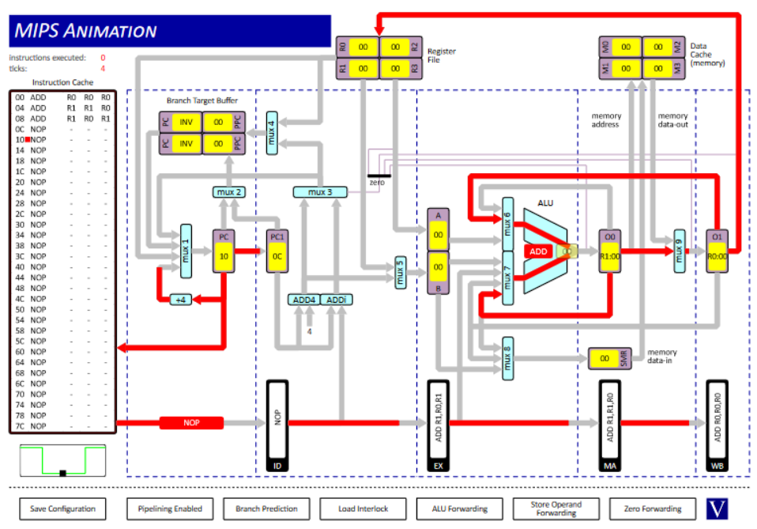
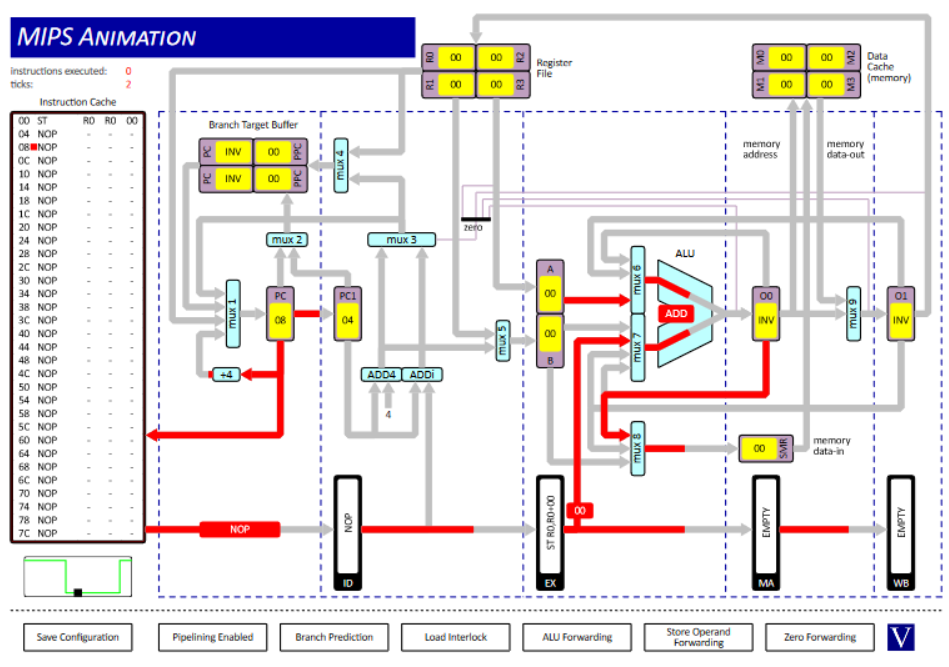
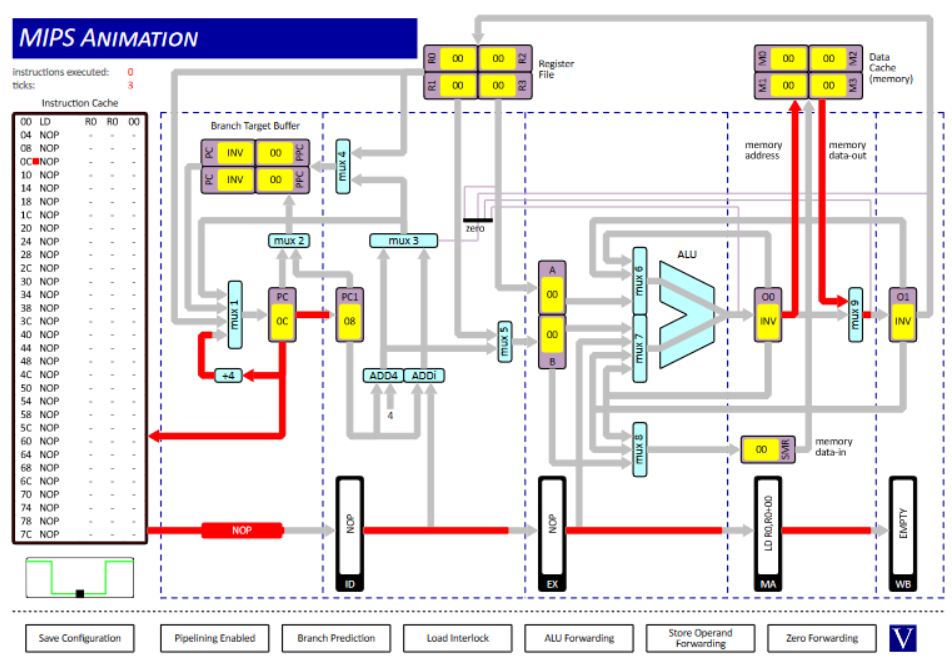
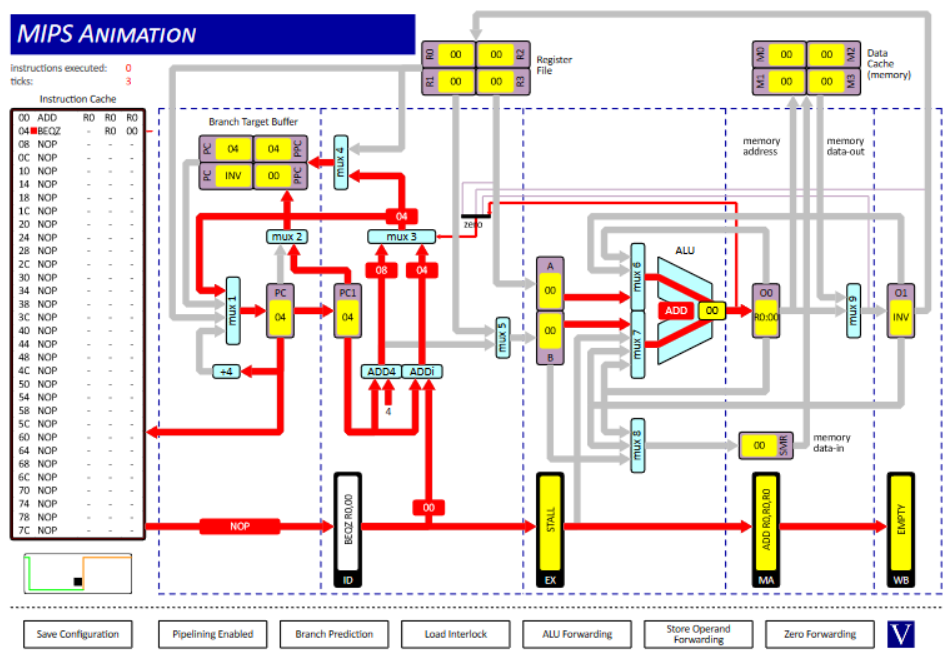
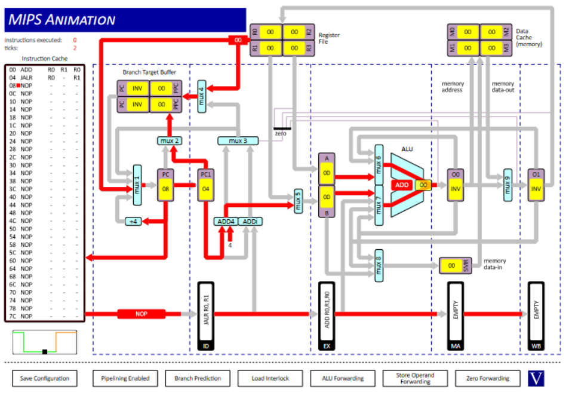

## Question 1

### 1. O1 to MUX6

```assembly
ADD		R0, R0, R0
ADD 	R1, R1, R0
ADD 	R1, R0, R1
```



### 2. O0 to MUX7 & O1 to MUX6

```assembly
ADD		R0, R0, R0
ADD 	R1, R1, R0
ADD 	R1, R0, R1
```


### 3. O0 to MUX8

```assembly
ST 		R0, R0, 0
```



### 4. EX to MUX7

```assembly
ST 	R0, R0, 0
```


### 5. DC to MUX9

```assembly
LD 		R0, R0, 0
```



### 6. O0 to ZD

```assembly
ADD		R0, R0, R0
BEQZ	R0, 0
```



### 7. RF to MUX1

```assembly
ADD 	R0, R1, R0
JALR	R0, R1
```



### 8. BTB to MUX1

```assembly
JAL 	R0, 0
```


