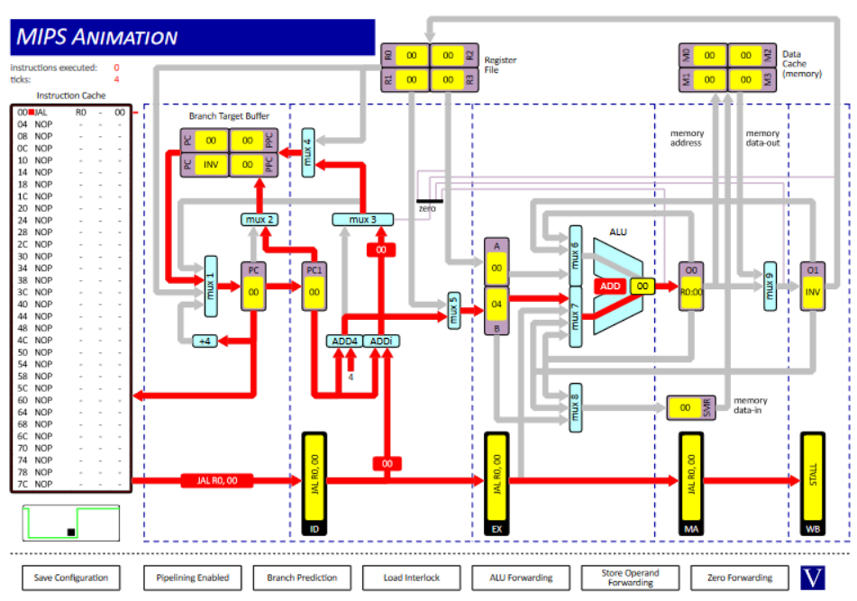

## Question 1

### 1. O1 to MUX6

```assembly
ADD		R0, R0, R0
ADD 	R1, R1, R0
ADD 	R1, R0, R1
```


### 2. O0 to MUX7 & O1 to MUX6

```assembly
ADD		R0, R0, R0
ADD 	R1, R1, R0
ADD 	R1, R0, R1
```


### 3. O0 to MUX8

```assembly
ST 		R0, R0, 0
```


### 4. EX to MUX7

```assembly
ST 	R0, R0, 0
```


### 5. DC to MUX9

```assembly
LD 		R0, R0, 0
```


### 6. O0 to ZD

```assembly
ADD		R0, R0, R0
BEQZ	R0, 0
```


### 7. RF to MUX1

```assembly
ADD 	R0, R1, R0
JALR	R0, R1
```


### 8. BTB to MUX1

```assembly
JAL 	R0, 0
```



## Question 2

| Question | R1 Value | Clock Cycles | Explanation
| - | - | - | - |
| i | 15 | 10 | Results in O0 and O1 can be fed back into the ALU without waiting for the values to be put in and gotten from the register file. |
| ii | 15 | 18 | Need to stall between instructions so that the registers can be updated as we don't store results in O1 or O0. |
| iii | 6 | 10 | No stalls are used so values are accessed before the correct data has been put into the register file leading to the incorrect result.  |
